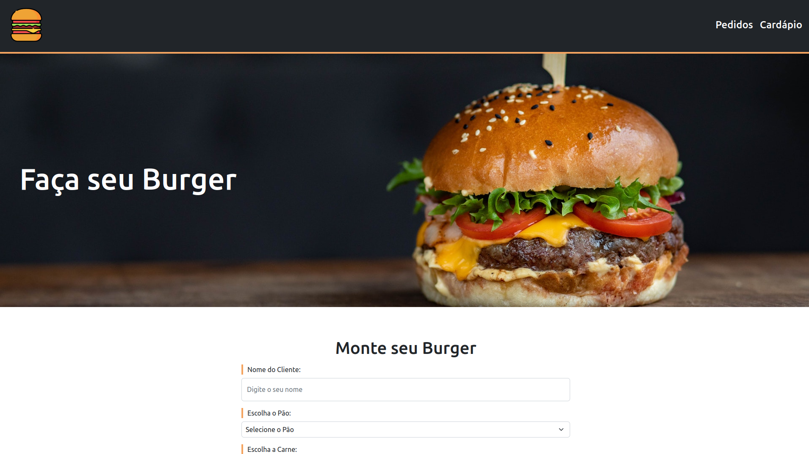

<h1 align="center"> Hamburgeria - Vue.js [Hora de Codar]</h1>

<p align="center">
  Projeto de CRUD para criar e gerenciar pedidos de uma burgeria online, com base no curso do Mateus Batisti, do site Hora de Codar.
</p>

<br>

<p align="center">
  
</p>

## 🚀 Tecnologias

Esse projeto foi desenvolvido com as seguintes tecnologias:

- [Vue.js](https://vuejs.org/)
- [Vite](https://vitejs.dev/config/)
- [Json Server](https://www.npmjs.com/package/json-server)

## 💻 Projeto

O projeto simula um crud simples de pedidos com as funções gerar o pedido, atualizar status e cancelar o pedido.

<h1 align="center"> Setup Fron-end & Back-end</h1>

## 🔥 Front-end

Instale as dependências do projeto:

```
npm install
```

Rode a aplicação:

```
npm run dev
```

e

```
npm run back
```

<br /><br /><br />

<h4 align="center">
 
  <br />
  Feito com ♥ no Ubuntu 22.04 LTS
</h1>
